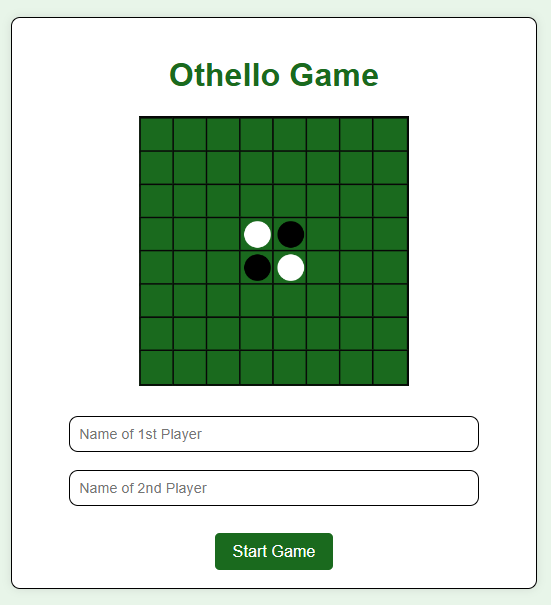
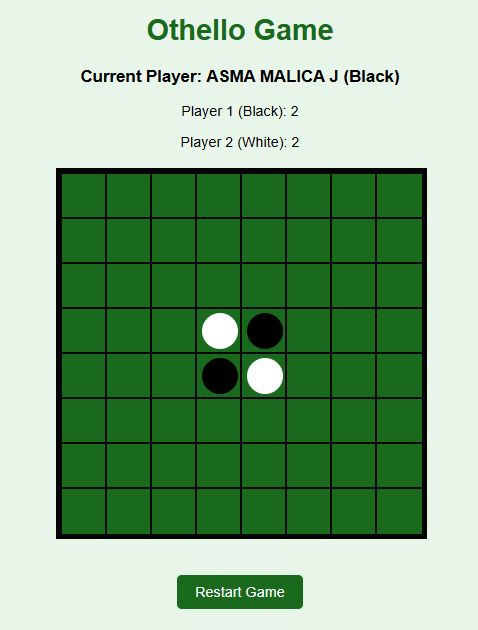
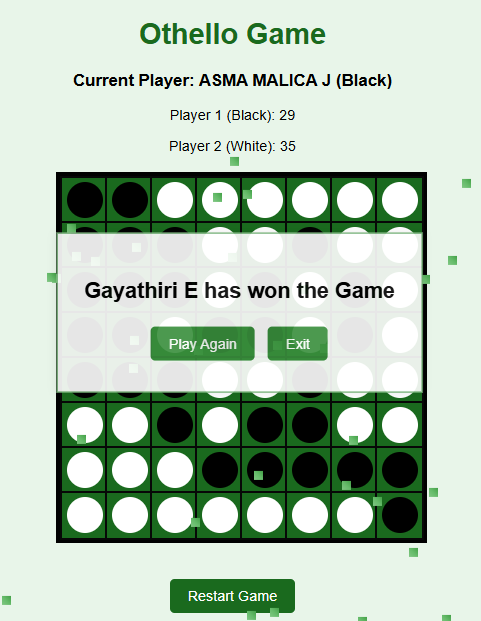

# Othello Game 
 - A web-based Othello (Reversi) game where two players compete against each other.The game features an 8x8 board, where players flip the opponent's discs to gain the majority of the board.

## Features
 - Simple and intuitive user interface.
 - Dynamic score updates for each player.
 - Confetti celebration for the winner.
 - Restart and play again options after the game ends.
 - Displays valid moves for the current player.

## Technologies Used
 - HTML for structure and layout.
 - CSS for styling and game board design.
 - JavaScript for game logic, interactions, and animations.

## How to Play 
- Open index.html in your browser.
- Enter the names of the two players.
- The game starts with Player 1 controlling the black pieces and Player 2 controlling the white pieces.
- Click on valid moves to place your disc and flip your opponent's discs.
- The game ends when neither player can make a valid move. The player with the most discs wins.

## Files Structure
 - index.html: The main entry point where players input their names.
 - othello.html: The game board and logic.
 - othello.css: Styles for the game, including the board and player interface.
 - script.js: Game logic, move validation, disc flipping, and end-game handling.
 - images/othello.png: Image for the game logo.

## Setup 
 - Clone or download the repository.
 - Open index.html in any web browser to start the game.
 
## Screenshots
 - 
 - 
 - 

 - Website Link - https://66e6f87d481c8405d1e63611--frolicking-smakager-e63cde.netlify.app/